# µMonitor — a touchscreen system dashboard for your Mac

µMonitor turns a **Particle Xenon** and an **Adafruit 3.5" TFT FeatherWing** into a little desk display for your
Mac. It shows live CPU/GPU, RAM, disk and network graphs, the top processes, a big clock, a photo album and a
timer/stopwatch. A menu bar app on the Mac (**µMonitor**) feeds it over USB and controls it, and the display has
its own touch menu.

| Dashboard (Quad) | Tiles layout |
|---|---|
| 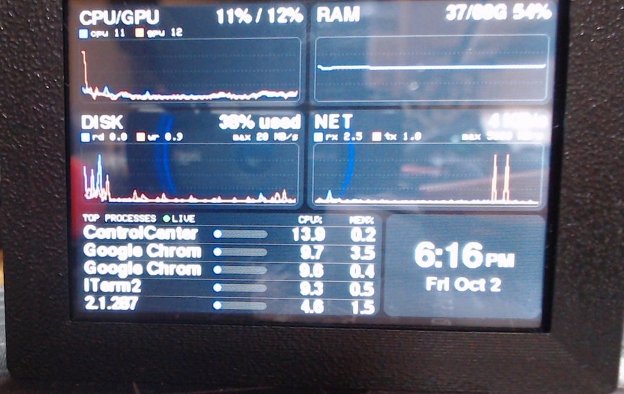 | 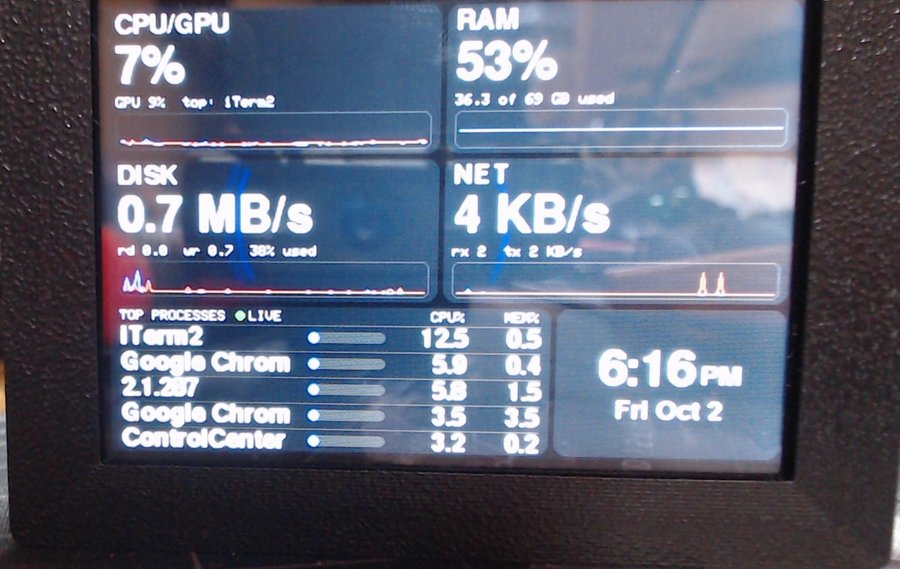 |
| **Touch menu** | **Album with clock badge** |
| 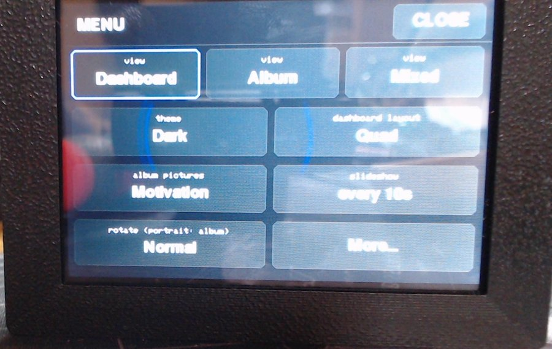 | 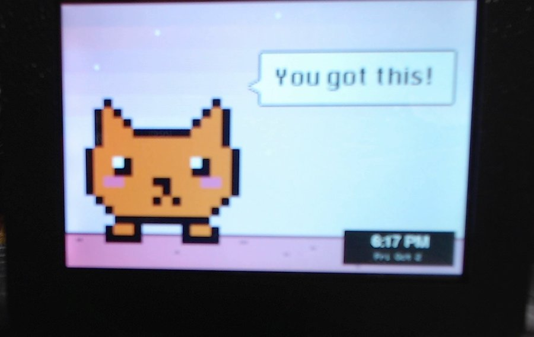 |
| **Mixed view** (photo + dashboard) | **Timer in the clock tile** |
| 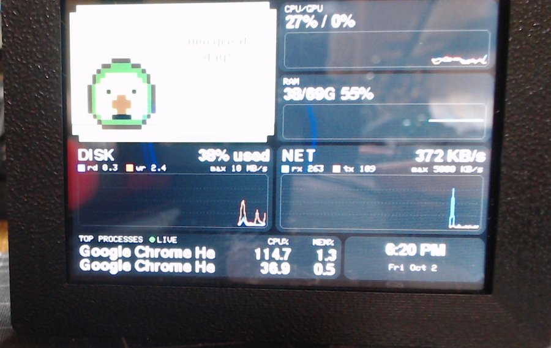 | 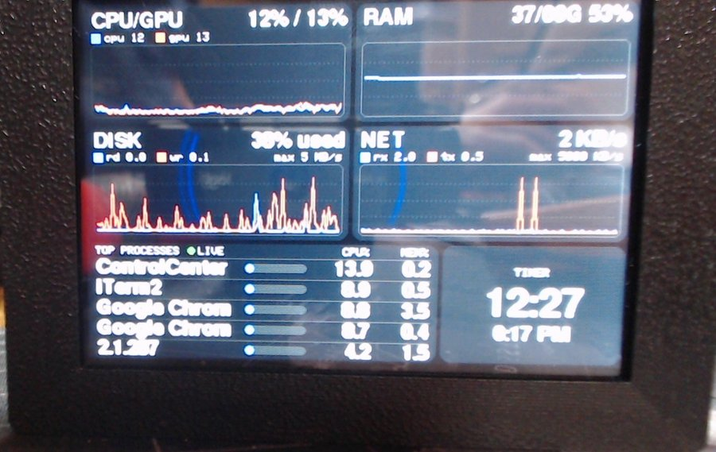 |

**Portrait** (stand the display upright and choose Rotation → Portrait). These are pixel-exact screenshots read back
from the display's memory:

| Mixed | Quad | Tiles | Album |
|---|---|---|---|
| 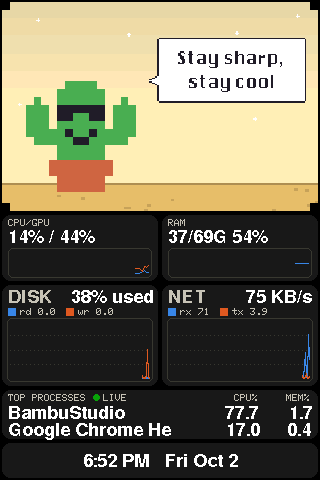 | 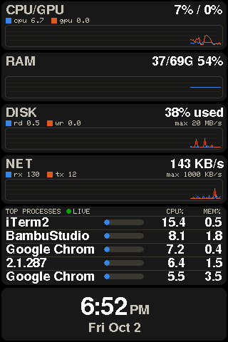 | 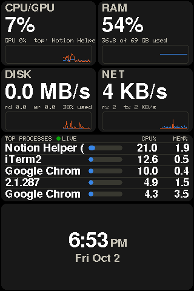 | 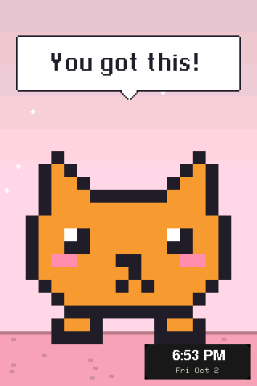 |

## Features

- **Live graphs**, refreshed every 2 seconds: CPU and GPU utilization, RAM, disk read/write and usage, network rx/tx
- **Top 5 processes** with CPU and memory, plus a **date/time tile**
- **4 layouts**: Quad, Stacked (8-minute history), Focus (one big graph; tap a tile to choose which), Tiles (big numbers)
- **8 themes**: Dark, Light, Retro Green, Amber, Ocean, Synthwave, Solarized, High Contrast (colorblind-safe graph colors)
- **Album view**: a slideshow of your photos or the built-in pixel-art "motivation" cards; tap the edges for
  previous/next; optional clock badge
- **Landscape or portrait**: every view has a portrait layout too; stand the display upright and choose Portrait
- **Mixed view**: a photo next to a compact dashboard
- **Timer and stopwatch**, started from the Mac and shown on the display; tap **TIME'S UP** to dismiss it
- **Touch menu** on the display, mirrored in the Mac menu bar app; changes on either side show up on the other
- Rounded cards, smooth FreeSans fonts, and settings that survive power-off (stored in the Xenon's EEPROM)

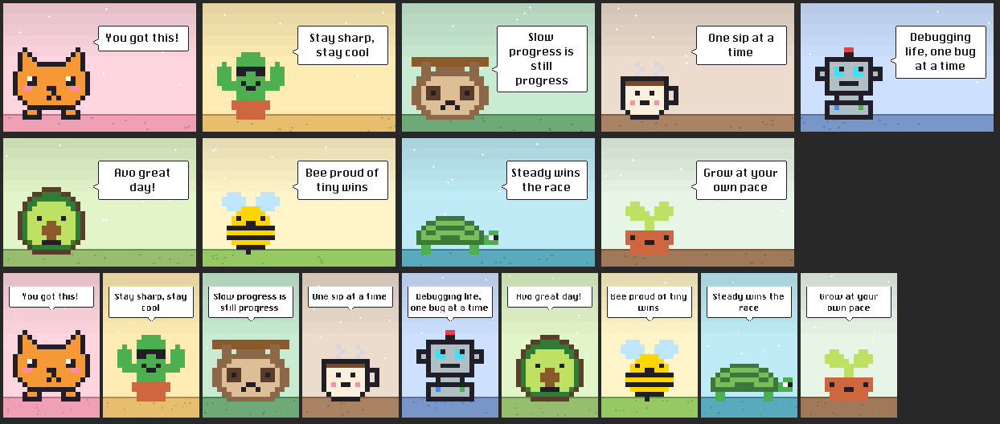

## Parts list

| # | Part | Qty | Notes |
|---|---|---|---|
| 1 | [Particle Xenon](https://docs.particle.io/reference/discontinued/hardware/xenon-datasheet/) | 1 | Feather-format nRF52840 board with male headers (discontinued; check eBay or old stock) |
| 2 | [Adafruit 3.5" 480x320 TFT FeatherWing](https://www.adafruit.com/product/3651) | 1 | HX8357D display, **STMPE610** resistive touch (the original V1 wing), microSD slot (not used) |
| 3 | Micro-USB cable | 1 | Must carry **data**, not just power: it is the link to the Mac |
| 4 | 3D-printed case (optional) | 1 | [Adafruit TFT 3.5" FeatherWing Housing / Enclosure (480x320)](https://www.thingiverse.com/thing:2836944) by Empor on Thingiverse; any PLA works |
| 5 | A Mac | 1 | Runs the µMonitor app; built and tested on Apple Silicon (M5 Pro), macOS 26 |

**Assembly:** plug the Xenon into the female headers on the back of the FeatherWing (the 16- and 12-pin headers only
fit one way), then put the pair in the case. No soldering or wiring beyond the headers.

Pin mapping (Feather pin → Xenon pin), handled in the firmware: TFT_CS 9 → **D4**, TFT_DC 10 → **D5**,
touch CS 6 → **D3**, SD CS 5 → D2 (kept high). SPI uses the standard SCK/MOSI/MISO pins.

No SD card is needed: pictures and themes stream from the Mac. (The wing's SD slot turned out to be unreliable in SPI
mode with this setup, so everything goes over USB instead.)

### Particle Xenon specs

From the [Particle Xenon datasheet](https://docs.particle.io/reference/discontinued/hardware/xenon-datasheet/):

| | |
|---|---|
| SoC | Nordic Semiconductor **nRF52840** |
| CPU | ARM **Cortex-M4F**, 32-bit, **64 MHz** |
| Memory | **1 MB** flash, **256 KB** RAM, plus **4 MB** on-board SPI flash |
| Radios | Bluetooth 5 (2 Mbps / 1 Mbps / 500 kbps / 125 kbps, up to +8 dBm), IEEE 802.15.4 (Particle Mesh, now retired), NFC tag |
| Antenna | On-board PCB antenna, plus a U.FL connector for an external one |
| I/O | 20 mixed-signal GPIO (6 analog, 8 PWM), UART, I2C, SPI |
| USB | Micro-USB 2.0 full speed (12 Mbps) |
| Debug | JTAG (SWD) connector |
| Power | Integrated Li-Po charger and battery connector; Li-Po 3.3–4.4 V, supply 3.0–3.6 V |
| Indicators / buttons | RGB status LED, RESET and MODE buttons |
| Form factor | Adafruit Feather compatible |
| Operating temperature | −20 to +60 °C |
| Status | Discontinued (last hardware revision v002, January 2020). The last Device OS that supports it is **1.5.2**, which this project uses. |

How µMonitor uses it: the 32 MHz SPI bus drives the display with DMA, USB serial carries the data from the Mac, and
the EEPROM emulation keeps settings and the touch calibration. About 22 KB of RAM is left free.

### Display specs (Adafruit 3.5" TFT FeatherWing)

| | |
|---|---|
| Panel | 3.5" TFT, **480 x 320**, 16-bit color, HX8357D controller (SPI) |
| Touch | 4-wire resistive, **STMPE610** controller (SPI) |
| Extras | microSD slot (not used here), reset button |

## How it works

```
Mac: µMonitor (host/menubar.py)                                     Xenon + 3.5" TFT FeatherWing
  collector.py  psutil + ioreg (GPU) ── JSON line every 2s ──────▶  firmware/dashboard
  timers.py     timer / stopwatch    ── "tm" inside each sample ─▶    graphs, table, clock, timer
  content.py    pictures + themes    ◀─ "req pic ..." / "req themes"   album / mixed view
                                     ── RLE RGB565 pixels ────────▶
  menu clicks   "cmd view 1" ...     ─────────────────────────────▶  touch menu changes
                checkmarks           ◀─ "state view=.. theme=.." ───
```

The firmware draws everything into a RAM canvas and pushes it to the display with DMA, which is much faster than
drawing pixel by pixel. Pictures are resized on the Mac and sent run-length encoded (pixel art is about 36x smaller).

## Install

### 1. Prerequisites (Mac)

```bash
brew install python@3.11 dfu-util node
npm install -g particle-cli          # Particle CLI (used for cloud compiling and flashing)
particle login                       # free Particle account; needed for the cloud compiler
```

### 2. Get the code and the Python environment

```bash
git clone https://github.com/jeaimehp/micromonitor.git
cd micromonitor
python3 -m venv .venv
.venv/bin/pip install psutil pyserial rumps py2app pillow pillow-heif
```

### 3. Put Device OS 1.5.2 on the Xenon (once)

Connect the Xenon by USB and put it in **DFU mode**: hold **MODE**, tap **RESET**, keep holding MODE until the LED
blinks **yellow**, then release.

```bash
particle update --target 1.5.2      # 1.5.2 is the last Device OS that supports the Xenon
```

### 4. Compile and flash the firmware

```bash
firmware/flash.sh firmware/dashboard
```

This compiles in the Particle cloud for `xenon` / Device OS 1.5.2 (libraries come from
`firmware/dashboard/project.properties`) and flashes over USB. The display shows **WAITING FOR HOST** until µMonitor runs.
`flash.sh` finds `particle` on your PATH (or in npm's global bin); override with `PARTICLE=/path/to/particle`.

### 5. Build and install the µMonitor menu bar app

```bash
.venv/bin/python setup.py py2app      # -> dist/µMonitor.app (self-contained, about 75 MB)
cp -R "dist/µMonitor.app" /Applications/
open "/Applications/µMonitor.app"
```

A small monitor icon shows up in the menu bar (there's no Dock icon), and the display switches to **LIVE**.
Use **Start at Login** in its menu to launch it automatically. Turn that on *after* copying the app to /Applications,
because the login item remembers where the app was.

## Using it

### On the display
- **Tap** anywhere to open the menu. It closes after 10 seconds or with CLOSE.
  - Choose the view (Dashboard / Album / Mixed), theme, layout, album folder, slideshow speed and rotation
    (Normal, Flipped, Portrait, Portrait flip). The menu itself always opens in landscape.
  - Under **More…**: the clock badge on pictures, which side the mixed-view photo goes on, and **Calibrate touch**
    (press the 4 targets).
- **Album**: tap the left or right third for the previous or next picture; the middle opens the menu.
- **Mixed view**: tap the photo for the next picture.
- **Focus layout**: tap a small tile to make it the big graph.
- **TIME'S UP**: tap the timer to go back to the clock.

### In the µMonitor menu
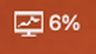

µMonitor lives in the menu bar as a small monitor icon with the current CPU % (or a running timer's countdown).

- **Display**: the same settings as the touch menu, plus Next/Previous Picture and Calibrate Touch…
- **Pictures**: Add Pictures… (copied into `~/Pictures/µMonitor`), Choose Photos Folder…, Open Photos Folder.
  JPG, PNG, HEIC and more are supported. Photos take 1–3 s to load and paint in from the top.
- **Timer**: 1/5/10/15/25/60 minutes, Custom…, Pause/Resume, Cancel. **Stopwatch**: Start/Stop, Reset.
  When a timer finishes, the display flashes and the Mac shows a notification. While a timer runs, the menu bar title
  shows the countdown.
- **Streaming** on/off, CPU % in the menu bar, Start at Login, Quit.

### Pictures folder notes
Hidden files are ignored (anything starting with `.`, e.g. the `._name` and `.DS_Store` files macOS creates), as are
subfolders. A file that can't be decoded is skipped.

### Without the app
`./run.sh -v` streams from the terminal instead (no pictures menu, but albums still work). Run either µMonitor or
`run.sh`, not both: they share the USB port, and the second one waits with "port busy".

## Customizing

- **Themes**: edit `THEMES` in `tools/make_themes.py`, then run `.venv/bin/python tools/make_themes.py`. It writes
  `content/themes/*.thm` (streamed by the app) and `firmware/dashboard/src/builtin_themes.h` (Dark + Light built into
  the firmware), and checks text contrast. Rebuild the app (and reflash if you changed a built-in theme).
- **Pixel art**: sprites and captions live in `tools/make_pixelart.py` (ASCII-art sprites).
  `.venv/bin/python tools/make_pixelart.py` regenerates `content/motivation/`.

## Screenshots

The firmware can read its frame memory back over USB (the FeatherWing wires the display's data-out line).
With µMonitor quit, run `.venv/bin/python tools/uitest.py "wait 5, shot NAME" --snapdir DIR` to save `DIR/NAME.png`
in the current orientation. It takes about 20 seconds; the display keeps its picture while it's read.

## Troubleshooting

| Symptom | Fix |
|---|---|
| Display says **NO HOST DATA** | Start µMonitor (or `./run.sh`); check that **Streaming** is on |
| Menu says **Xenon port busy** | Another sender (`run.sh`, a serial monitor) has the port; quit it |
| Taps land in the wrong place | Display menu **More… → Calibrate**, or µMonitor **Display → Calibrate Touch…** |
| Album says **NO PHOTOS YET** | µMonitor **Pictures → Add Pictures…** |
| Some processes are missing | macOS hides root-owned processes (e.g. WindowServer) unless the collector runs as root |
| `particle update` can't find the device | Put the Xenon in DFU mode (blinking yellow) and retry |

## Project layout

```
firmware/dashboard/   Device firmware (C++, Device OS 1.5.2): main, gfx, dashboard_view, album, menu, touch,
                      control (settings/commands/timer), hostcontent (themes + pictures), settings (EEPROM)
firmware/flash.sh     Cloud compile + USB flash helper
firmware/hello, touchtest   Bring-up test firmware (USB serial heartbeat, touch calibration)
host/                 µMonitor: menubar.py (app), sender.py (USB streamer), collector.py (metrics),
                      content.py (pictures/themes), timers.py (timer/stopwatch)
content/              Themes, motivation pixel art, contact sheet (bundled into the app)
tools/                make_themes.py, make_pixelart.py, make_icon.py, uitest.py (drives the UI over serial),
                      snap.sh (webcam photo), install-launchd.sh (autostart for run.sh)
setup.py              py2app build for µMonitor
pickupandgo.md        Detailed engineering notes / handoff log for every step
```

## License

[MIT](LICENSE). The firmware uses the Adafruit HX8357, GFX and STMPE610 libraries (Particle ports by rickkas7), which carry their own BSD licenses.
